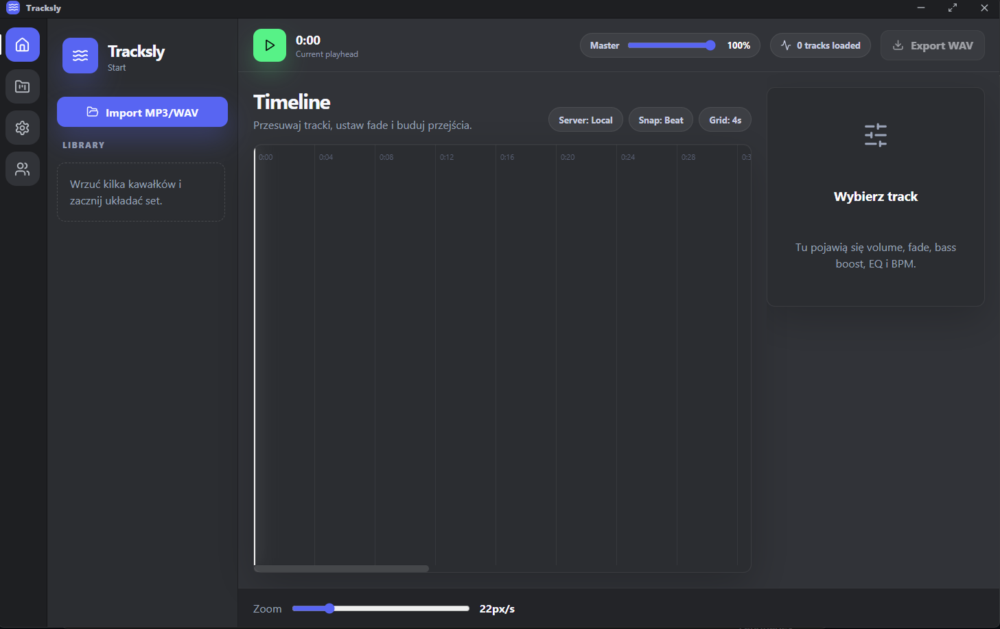

# Tracksly

Tracksly is a desktop DJ mix editor built with Electron, React and TypeScript.  
The goal of the project is to provide a modern and lightweight alternative for creating simple DJ sets without using complicated DAWs.

The app focuses on:
- quick audio importing,
- timeline editing,
- fade transitions,
- waveform visualization,
- bass/EQ controls,
- project saving/loading,
- exporting finished mixes.

---

## Preview

Features currently available:
- MP3/WAV importing
- draggable timeline clips
- trimming clips from left/right edges
- fade in / fade out
- volume controls
- master volume
- waveform rendering
- project saving/loading
- custom `.tracksly` project format
- Discord-inspired dark UI

---

## Tech Stack

Frontend:
- React
- TypeScript
- Vite
- TailwindCSS

Desktop:
- Electron

Audio:
- Web Audio API
- OfflineAudioContext

State:
- Zustand

---

## Installation

Clone repository:

```bash
git clone https://github.com/D4NTE98/tracksly.git
```

Open project folder:

```bash
cd tracksly
```

Install dependencies:

```bash
npm install
```

Run development mode:

```bash
npm run dev
```

---

## Building

Build application:

```bash
npm run build
```

---

## Project Format

Tracksly uses its own project format:

```txt
.tracksly
```

Saved projects contain:
- imported audio file paths,
- timeline positions,
- trim values,
- fade settings,
- EQ values,
- volume settings.

---

## Roadmap

Planned features:
- BPM detection
- beat grid snapping
- audio effects
- MP3 exporting
- real-time spectrum analyzer
- automation curves
- keyboard shortcuts
- multi-track rendering
- plugin system

---

## Preview





---

## Notes

This project is still in development and some features are experimental.

---

## Author

Created by D4NTE

GitHub:
https://github.com/D4NTE98

---

## License

MIT License
